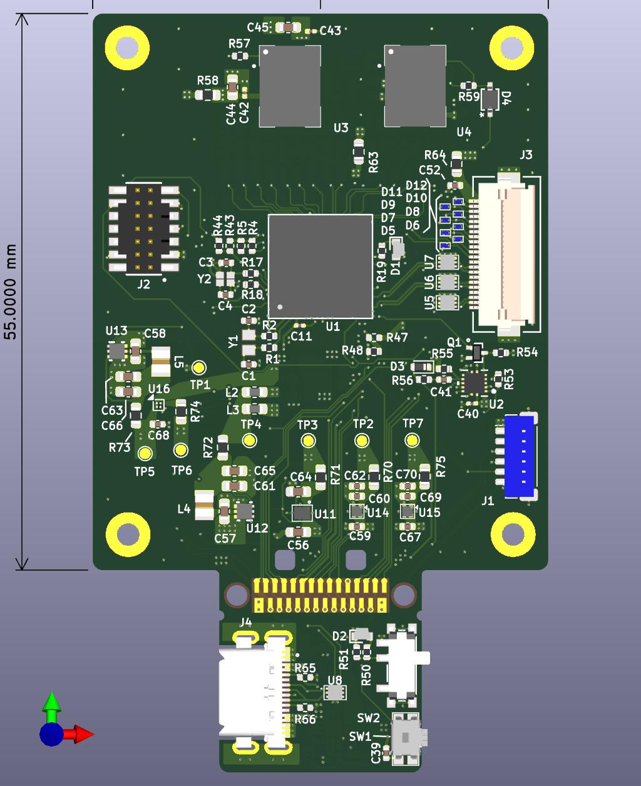
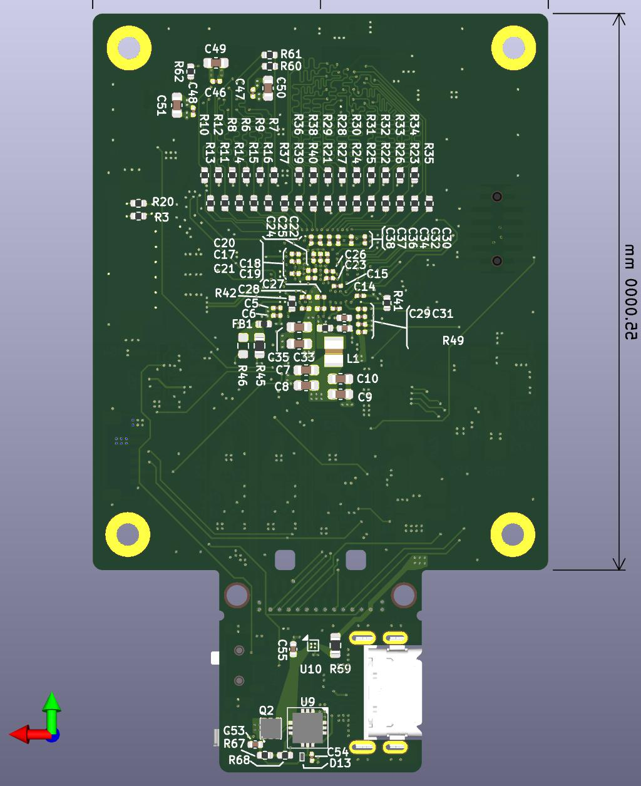

# AP05 STM32N6

LeafonyのMCUリーフ「AP05 STM32N6」のハードウェア設計リポジトリです。KiCadの回路図・基板データ、部品ライブラリ、製造用データを収録しています。

AP05は、STMicroelectronicsのSTM32N6シリーズを採用し、Arm Cortex-M55による画像処理やエッジAIの評価に利用するリーフです。製品概要は[Leafony公式ドキュメント](https://docs.leafony.com/leaf/processor/ap05/)を参照してください。

## 主な用途

- カメラを使った画像処理・エッジAIアプリケーションの試作
- STM32N6向けファームウェアの開発・検証
- Leafony Busを介した他のリーフとの接続・評価

## ハードウェア構成

以下は、本リポジトリの回路図・基板データに記載されている構成です。

| 項目 | 内容 |
| --- | --- |
| MCU | STM32N657L0H3Q（STMicroelectronics） |
| CPU | Arm Cortex-M55 |
| 外部Flash | MX25UM51245GXDI00-TR |
| 外部PSRAM | APS256XXN-OBR-BG |
| 接続 | Leafony Bus、USB Type-C、カメラコネクタ、デバッグ用コネクタ |
| 基板 | 6層、板厚0.8 mm |
| 設計ツール | KiCad 9.0 |

ピン接続や電源回路の詳細は、[回路図](kicad/leafony-stm32n6/exported/leafony-stm32n6_schematics.pdf)を参照してください。

## 基板イメージ

設計データから出力した3D表示です。

| 表面 | 裏面 |
| --- | --- |
|  |  |

## 設計資料

| 資料 | ファイル |
| --- | --- |
| KiCadプロジェクト | [leafony-stm32n6.kicad_pro](kicad/leafony-stm32n6/leafony-stm32n6.kicad_pro) |
| 回路図 | [PDF](kicad/leafony-stm32n6/exported/leafony-stm32n6_schematics.pdf) / [KiCad](kicad/leafony-stm32n6/leafony-stm32n6.kicad_sch) |
| 基板レイアウト | [PDF](kicad/leafony-stm32n6/exported/leafony-stm32n6_layout.pdf) / [KiCad](kicad/leafony-stm32n6/leafony-stm32n6.kicad_pcb) |
| 部品表（BOM） | [Excel](kicad/leafony-stm32n6/exported/leafony-stm32n6_BOM.xlsx) |
| 基板3Dモデル | [STEP](kicad/leafony-stm32n6/exported/leafony-stm32n6.step) |
| 製造用データ | [Gerber・ドリル・部品位置データ](kicad/leafony-stm32n6/exported/Gerber/) |

## ディレクトリ構成

```text
kicad/leafony-stm32n6/
├── leafony-stm32n6.kicad_pro   # KiCadプロジェクト
├── leafony-stm32n6.kicad_sch   # トップ階層の回路図
├── leafony-stm32n6.kicad_pcb   # 基板レイアウト
├── *.kicad_sch                # MCU、電源、メモリ、USBなどの階層回路図
├── sym-lib-table              # プロジェクト用シンボルライブラリ設定
├── fp-lib-table               # プロジェクト用フットプリントライブラリ設定
├── lib/
│   ├── Leafony.kicad_sym      # Leafony用シンボル
│   ├── Leafony.pretty/        # Leafony用フットプリント
│   └── 3dmodels/              # 部品の3Dモデル
├── assets/                   # 設計関連の画像
└── exported/                 # 回路図PDF、BOM、STEP、基板画像など
    └── Gerber/               # Gerber、ドリル、部品位置データ
```

## KiCadで開く

1. KiCad 9.0と標準ライブラリを用意します。3D表示を使用する場合は標準3Dモデルもインストールしてください。
2. このリポジトリをcloneするか、ZIPでダウンロードして展開します。
3. `kicad/leafony-stm32n6/leafony-stm32n6.kicad_pro` をKiCadで開きます。
4. プロジェクトマネージャーから回路図エディターまたはPCBエディターを起動します。

Leafony用のシンボルとフットプリントは、プロジェクト内の `sym-lib-table` と `fp-lib-table` から `${KIPRJMOD}/lib/` を参照します。フォルダー構成を保ったまま開いてください。基板の標準3Dモデルは `KICAD9_3DMODEL_DIR` を参照しています。

## ファームウェア開発

公式ドキュメントでは、STM32N6向けの開発環境としてSTM32CubeIDEと[STM32CubeN6](https://github.com/STMicroelectronics/STM32CubeN6)が案内されています。本リポジトリにはファームウェアを収録していません。

## 関連リンク

- [AP05 STM32N6 — Leafony公式ドキュメント](https://docs.leafony.com/leaf/processor/ap05/)
- [STM32N6シリーズ — STMicroelectronics](https://www.st.com/en/microcontrollers-microprocessors/stm32n6-series.html)
- [STM32N6シリーズの技術資料](https://www.st.com/en/microcontrollers-microprocessors/stm32n6-series/documentation.html)
- [STM32CubeN6 — 公式GitHubリポジトリ](https://github.com/STMicroelectronics/STM32CubeN6)
